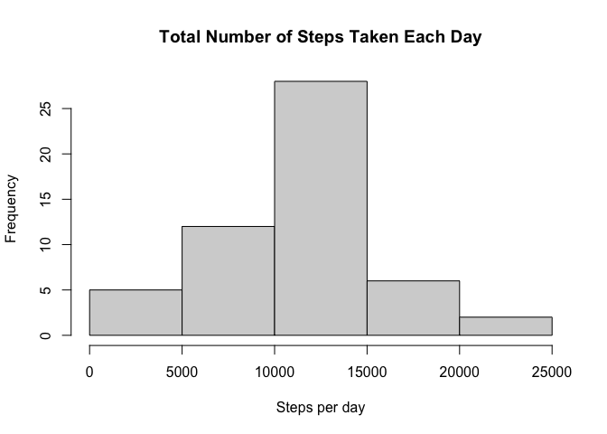
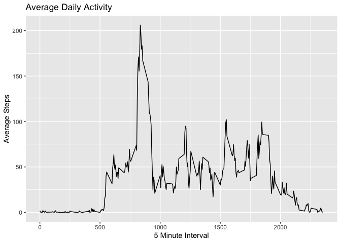
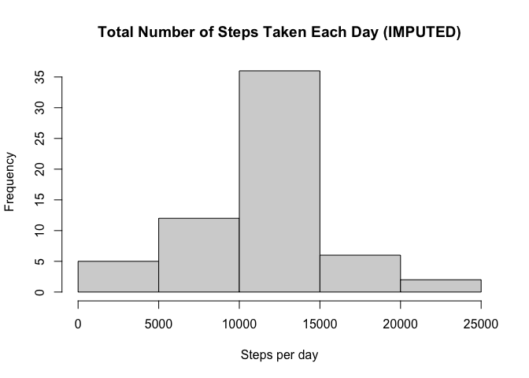
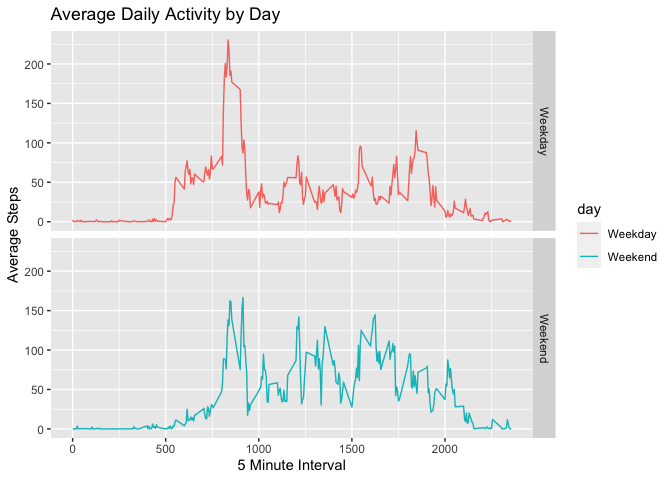

#### Show any code that is needed to

##### 1. Load the data (i.e. read.csv)

##### 2. Process/transform the data (if necessary) into a format suitable for your analysis

``` r
#load the data
activity <- read.csv("activity.csv")
#change class of date from character to date
activity$date <- as.Date(activity$date)
#check the data
head(activity)
```

    ##   steps       date interval
    ## 1    NA 2012-10-01        0
    ## 2    NA 2012-10-01        5
    ## 3    NA 2012-10-01       10
    ## 4    NA 2012-10-01       15
    ## 5    NA 2012-10-01       20
    ## 6    NA 2012-10-01       25

#### What is mean total number of steps taken per day?

For this part of the assignment, you can ignore the missing values in
the dataset.

##### 1. Calculate the total number of steps taken per day

``` r
#load plyr package
library(plyr)
#calculate total steps taken for each day
totalSteps <- ddply(activity, .(activity$date), function(x) sum(x$steps))
#change column names to date and steps
colnames(totalSteps)[1] <- "date"
colnames(totalSteps)[2] <- "steps"
#check the data
head(totalSteps)
```

    ##         date steps
    ## 1 2012-10-01    NA
    ## 2 2012-10-02   126
    ## 3 2012-10-03 11352
    ## 4 2012-10-04 12116
    ## 5 2012-10-05 13294
    ## 6 2012-10-06 15420

##### 2. If you do not understand the difference between a histogram and a barplot, research the difference between them. Make a histogram of the total number of steps taken each day

``` r
#display histogram of the total number of steps taken each day
hist(totalSteps$steps, main="Total Number of Steps Taken Each Day", xlab="Steps per day")
```



##### 3. Calculate and report the mean and median of the total number of steps taken per day

``` r
#calculate mean of the total number of steps taken per day
mean(totalSteps$steps, na.rm = TRUE)
```

    ## [1] 10766.19

``` r
#calculate median of the total number of steps taken per day
median(totalSteps$steps, na.rm = TRUE)
```

    ## [1] 10765

#### What is the average daily activity pattern?

##### 1. Make a time series plot (i.e. type = “l”) of the 5-minute interval (x-axis) and the average number of steps taken, averaged across all days (y-axis)

``` r
#load ggplot package
library(ggplot2)
#calculate average number of steps taken
meanSteps <- ddply(activity, c("interval"), summarise,
                   mean=mean(steps, na.rm=TRUE))
#display time series plot
ggplot(meanSteps) + geom_line(aes(x=interval, y=mean)) + ylab("Average Steps") + 
        xlab("5 Minute Interval")+ggtitle("Average Daily Activity ")
```



##### 2. Which 5-minute interval, on average across all the days in the dataset, contains the maximum number of steps?

``` r
#display the maximum number of steps
meanSteps$interval[which.max(meanSteps$mean)]
```

    ## [1] 835

#### Imputing missing values

Note that there are a number of days/intervals where there are missing
values (coded as NA). The presence of missing days may introduce bias
into some calculations or summaries of the data.

##### 1. Calculate and report the total number of missing values in the dataset (i.e. the total number of rows with NAs)

``` r
#calculate the total number of NAs
sum(is.na(activity$steps))
```

    ## [1] 2304

##### 2. Devise a strategy for filling in all of the missing values in the dataset. The strategy does not need to be sophisticated. For example, you could use the mean/median for that day, or the mean for that 5-minute interval, etc.

``` r
#set up a new dataset for imputing missing values
imp <- activity
#fill in all of the missing values with the mean for that 5-minute interval
for (i in 1:nrow(imp)) {
        if(is.na(imp$steps[i])) {
                rep <- meanSteps$mean[which(meanSteps$interval == imp$interval[i])]
                imp$steps[i] <- rep
        }
}
#No missing values after filling in all missing values
sum(is.na(imp$steps))
```

    ## [1] 0

##### 3. Create a new dataset that is equal to the original dataset but with the missing data filled in.

``` r
##calculate total steps taken for each day
totalSteps2 <- ddply(imp, .(imp$date), function(x) sum(x$steps))
#change column names to date and steps
colnames(totalSteps2)[1] <- "date"
colnames(totalSteps2)[2] <- "steps"
#check the data
head(totalSteps2)
```

    ##         date    steps
    ## 1 2012-10-01 10766.19
    ## 2 2012-10-02   126.00
    ## 3 2012-10-03 11352.00
    ## 4 2012-10-04 12116.00
    ## 5 2012-10-05 13294.00
    ## 6 2012-10-06 15420.00

##### 4. Make a histogram of the total number of steps taken each day and Calculate and report the mean and median total number of steps taken per day. Do these values differ from the estimates from the first part of the assignment? What is the impact of imputing missing data on the estimates of the total daily number of steps?

``` r
#display histogram of the total number of steps taken each day
hist(totalSteps2$steps, main="Total Number of Steps Taken Each Day (IMPUTED)", xlab="Steps per day")
```



#### Are there differences in activity patterns between weekdays and weekends?

For this part the weekdays() function may be of some help here. Use the
dataset with the filled-in missing values for this part.

##### 1. Create a new factor variable in the dataset with two levels – “weekday” and “weekend” indicating whether a given date is a weekday or weekend day.

``` r
#load lubridate package
library(lubridate)
```

    ## 
    ## Attaching package: 'lubridate'

    ## The following objects are masked from 'package:base':
    ## 
    ##     date, intersect, setdiff, union

``` r
#adding a new column as day of week in numeric values
imp['day'] <- wday(imp$date)
#converting 1 and 7 to Weekend
imp$day[imp$day %in% c(1,7)] <- "Weekend"
#converting values other than Weekend as Weekday
imp$day[imp$day != "Weekend"] <-'Weekday'
```

##### 2. Make a panel plot containing a time series plot (i.e. type = “l”) of the 5-minute interval (x-axis) and the average number of steps taken, averaged across all weekday days or weekend days (y-axis). See the README file in the GitHub repository to see an example of what this plot should look like using simulated data.

``` r
#caculate average across all weekdays and weekend
meanSteps2 <- ddply(imp, c("interval",'day'), summarise,
                   mean=mean(steps, na.rm=TRUE))
#load ggplot package
library(ggplot2)
#display time serires plot
ggplot(meanSteps2, aes(interval, mean)) + geom_line(aes(colour = day)) + ylab("Average Steps") + 
        xlab("5 Minute Interval") + ggtitle("Average Daily Activity by Day") + facet_grid(day ~ .)
```


